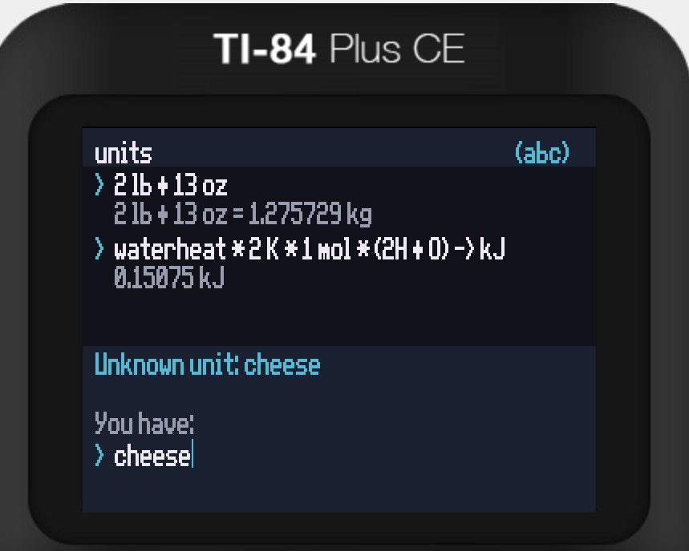

# units for TI-84 Plus CE

the amazing unit calculator!!
featuring...

### Quick install
1. [Jailbreak](https://yvantt.github.io/arTIfiCE/) your calculator if its OS version >=5.5
2. use [TI Connect CE](https://education.ti.com/en/products/computer-software/ti-connect-ce-sw) to transfer the files in `quick-install/` to your calculator to install as a `prgm`.
3. To run, select `prgm`, `UNITCALC`. (2nd+off to quit)

### Workflow

* Install [CE C/C++ Toolchain](https://ce-programming.github.io/toolchain/static/getting-started.html)
* `make` to compile to `bin/`

Use TI Connect CE to transfer:
* `UNITCALC.8xp` (in `bin/`)
* `UNITDB.8xv` (in `bin/`)
* `clibs.8xg` (library, download [here](https://tiny.cc/clibs))
